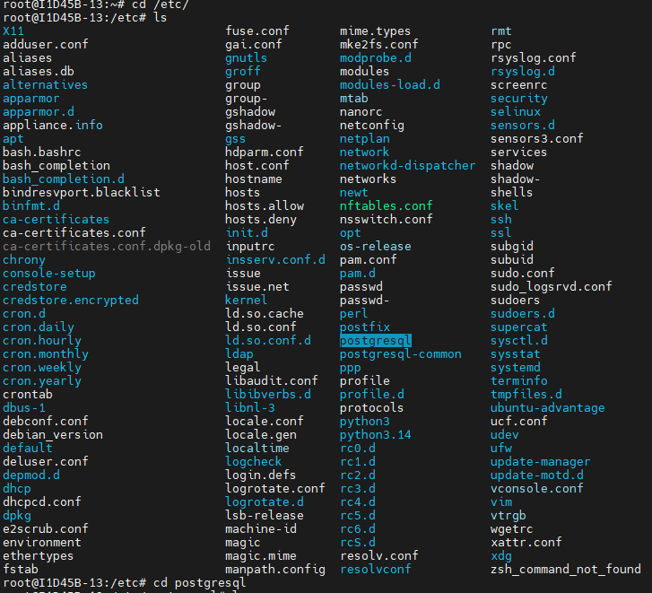
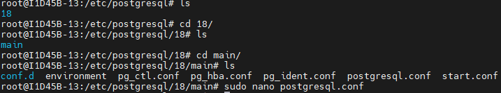
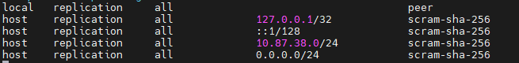
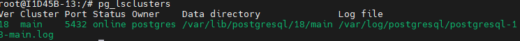

## Configurando o SGBD
**SGBD: Sistema Gerenciador de Banco de Dados**
---

Para instalação utilizamos o comando:

```bash
sudo apt install -y postgresql
```
>No meu servidor, como eu já estava como root, não precisou do sudo.

Para acesso inicial, utilizamos o comando:

```bash
sudo -u postgres psql
```

Após primeiro acesso, alteramos a senha, através do comando:
```sql
ALTER USER postgres PASSWORD '---';
```

Para sair do SGBD, utilizamos o comando: `/q`
>Comando famoso \quit em games.

Para acesso externo, utilizamos o comando:
```bash
sudo psql -h 127.0.0.1 -U postgres
```
>Aqui, ele vai precisar da senha!
---
Alterações nos arquivos:

Utilizei `cd/etc` para entrar no dirétorio e depois utilizei `ls` para listar todos, e, após achar o postgresql, usei `cd` para entrar dentro do diretório.


Aqui usei `ls` para ver o que tinha dentro do postgresql, e depois entrei no diretório 18 (número da versão do postgresql). Após isso utilizei `ls` novamente, entrei no diretório `main` e listei para ver tudo que havia dentro.

A primera alteração foi feita no arquivo postgresql.conf. Para alterar foi necessário o uso do comando:
```bash
sudo nano postgresql.conf
```

Nesse arquivo foi alterado a "escuta" de endereço sendo alterado o listen_adress para '*' (print abaixo)


A segunda alteração foi feita no arquivo pg_hba.conf. Para alterar foi usado o comando:
```bash
sudo nano pg_hba.conf
```

Nesse arquivo foi adicionado a liberação de todas as faixas de ip para acesso externo (print abaixo)


>O motivo para ter utilizado o ip *0.0.0.0* foi para que todos os computadores com faixas de ip totalmente diferentes tenham acesso, pois ele é um endereço padrão, ou seja, qualquer outro tem acesso pela rede (mesmo sendo interna ou externa).

*Um comando interessante é o tracert. Ele é utilizado para descobrir o endereço de IP de algum site por meio da URL. Isso acontece por meio do DNS, pois ele age como um lista telefônica (transforma o nome em número). Como exemplo usamos o google, descobrindo que o IP dele é 216.239.38.120*
---
O 1º comando que utilizamos foi o:
`CREATE DATABASE cidades;`
Ele foi utilizado para criar um novo banco de dados com o nome "cidades"

Para listar todos os bancos de dados utiliza-se o comando `\l`

Para restartar a aplicação utilizamos o comando `sudo systemctl restart postgresql`

Após restartar a aplicação, verificamos o status da mesma com o comando `sudo systemctl status postgresql`

O comando bash `pg_lsclusters` exibe o status e outras informações sobre o postgresql. No meu caso ficou verde, então estava tudo 👍. 

Caso estivesse vermelho seria necessário iniciar o postgresql por meio do comando `sudo systemctl start postgresql`

Porta padrão do postgresql -> 5432