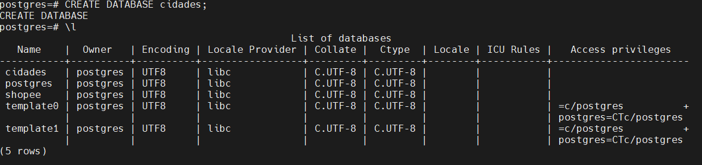
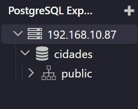

### Relatório Atividade

Para começar, criei o banco de dados cidades utilizando o comando
```sql
CREATE DATABASE cidades;
```

Após isso, utilizei o `\l` para checar se tinha criado ⬇️



---

Depois utilizei a extensão no VsCode para entrar no banco de dados cidades e criar uma nova query. 


Começei criando uma tabela com o comando:
```sql
CREATE TABLE cidades(
    id INT GENERATED ALWAYS AS IDENTITY PRIMARY KEY NOT NULL,
    nome VARCHAR(50) NOT NULL,
    país VARCHAR(50) NOT NULL,
    população INT NOT NULL DEFAULT 0
);
```

Depois de criada, começei a inserir os dados. Para inserir os dados das 10 cidades de uma vez só usei o comando:
```sql
INSERT INTO cidades(nome,país,população)
VALUES
('Tóquio','Japão','14000000'),
('Nova Iorque','Estados Unidos','8500000'),
('Los Angeles','Estados Unidos','3800000'),
('Londres','Reino Unido','9000000'),
('Seul','Coreia do Sul','9600000'),
('Paris','França','2100000'),
('Chicago','Estados Unidos','2700000'),
('Osaka','Japão','2800000'),
('São Francisco','Estados Unidos','810000'),
('Xangai','China','24800000');
```

E por fim consultei todos os valores com o comando:
```sql
SELECT * FROM cidades;
```