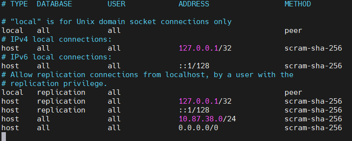
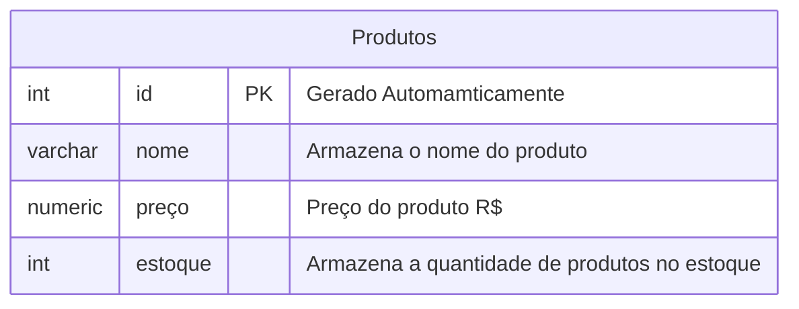

## Aula 04
Alteração de parâmetros dos arquivos de configuração:

10.87.38.0/24 -> **Libera todas as faixas da minha rede**

0.0.0.0/0 -> **Habilita qualquer IP**

O **/32** faz com que apenas um endereço tenha acesso



---

Para excluir um banco de dados, utilizamos o comando:
```sql
DROP DATABASE cidades;
```
>Cuidado na operação!
---
Primeiro, iniciamos o processo criando um novo banco de dados:
```sql
CREATE DATABASE shopee;
```

>Para conectar o banco de dados criado ao VsCode, utilizamos a extensão PostgreSQL. Nela colocamos nosso IP, o nome de usuário `postgres`, a senha usada no servidor, a porta 5432 e por fim escolhemos o banco de dados criado (shopee/loja).


---
**Modelando o primeiro banco de dados**

Para criação do banco de dados, utilizamos os seguintes comandos:

```sql
CREATE TABLE produtos(
    id INT GENERATED ALWAYS AS IDENTITY PRIMARY KEY NOT NULL,
    nome VARCHAR(50) NOT NULL,
    preço NUMERIC(10,2) NOT NULL,
    estoque INT NOT NULL DEFAULT 0
);
```

Para consultar todos os dados da tabela:
```sql
SELECT * FROM produtos;
```

Para inserir valores na tabela:
```sql
INSERT INTO produtos(nome,preço,estoque)
VALUES('Chuveiro', '100', '20');
SELECT * FROM produtos;
```