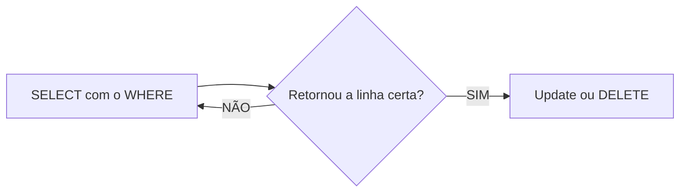

## Update e Delete
**Update** ou **Delete** afetam todas as linhas da sua tabela. Logo, **JAMAIS** executar sem comando `WHERE`. 

```mermaid
flowchart LR
A[SELECT com o WHERE] --> B{Retornou a linha certa?}
B--SIM-->C[Update ou DELETE]
B--NÃO-->A
``` 