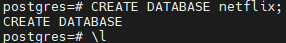
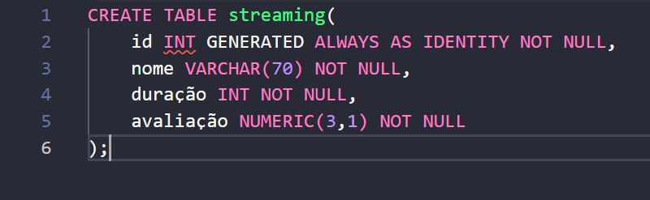
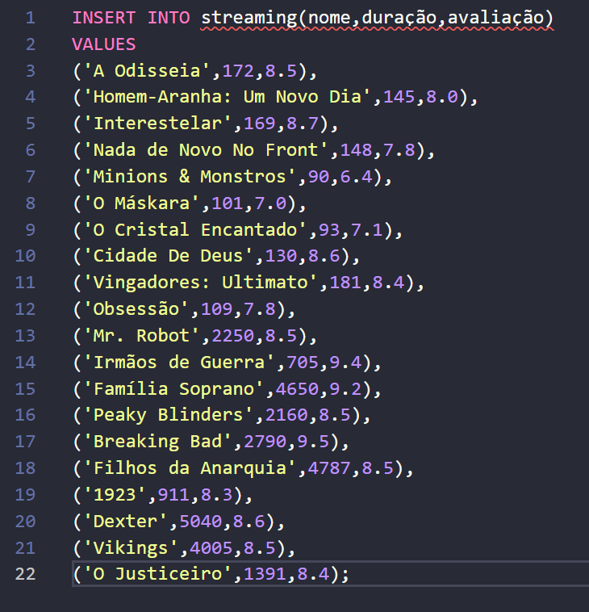
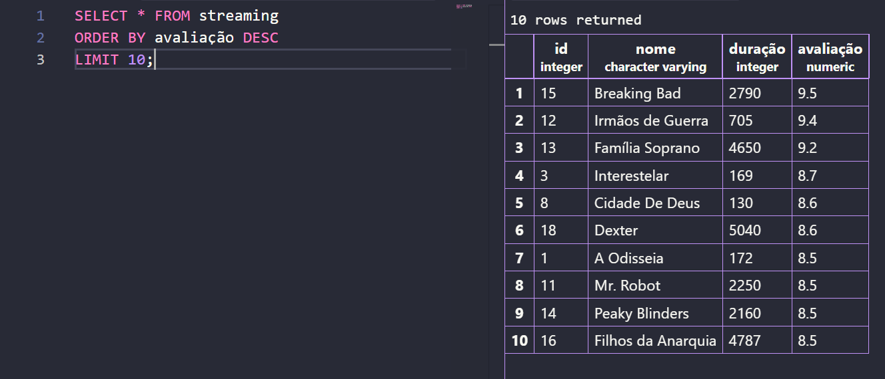
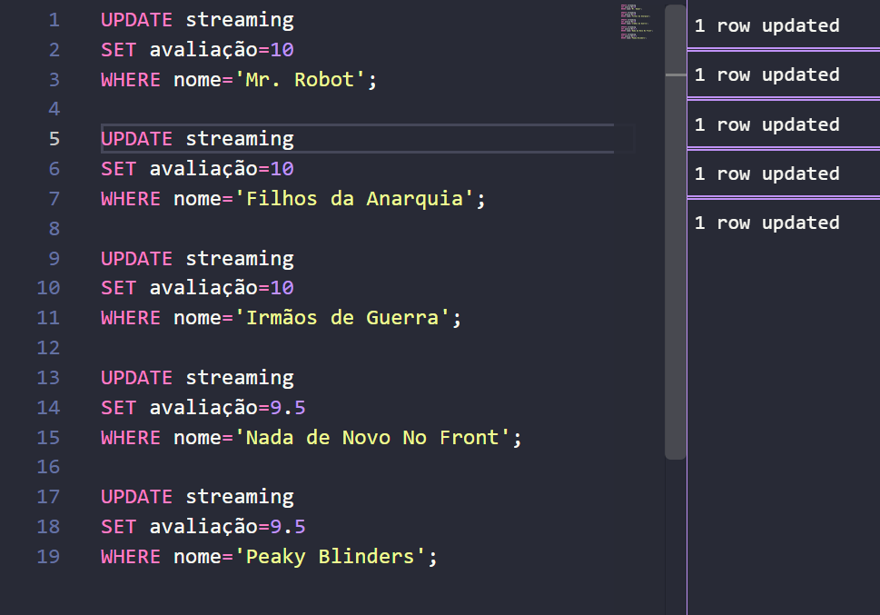
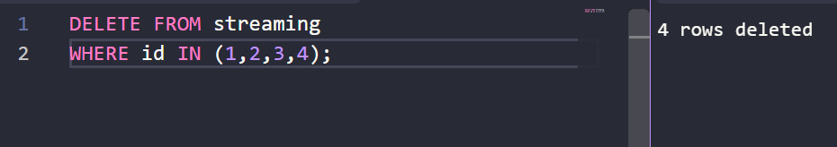

Para criar o Banco de Dados, voltei no servidor e utilizei o comando `CREATE DATABASE netflix;` e depois utilizei `\l` para confirmar

Começando pela criação da tabela, utilizei o comando `CREATE TABLE streaming` e defini o ID, nome, duração(min) e avaliação.

Para inserir as informações dos 20 registros, optei por escolher 10 filmes e 10 séries. Inseri os registros usando o comando `INSERT INTO streaming(nome,duração,avaliação) VALUES`

Para exibir os 10 registros mais bem avaliados, usei o comando `SELECT * FROM streaming` para selecionar todos os registros, `ORDER BY avaliação DESC` para ordenar pela avaliação de forma descendente (maior pro menor), e `LIMIT 10;` para definir um limite de 10, assim mostrando os 10 mais bem avaliados

Para atualizar as notas, usei o comando `UPDATE streaming` para atulizar o banco, `SET avaliação=10` e `SET avaliação=9.5` para atualizar algumas notas para 10 e outras para 9.5 e `WHERE nome=''` para definir qual filme ou série teria a nota alterada

E por fim, para apagar os registros, usei o comando `DELETE FROM streaming` e `WHERE id IN(1,2,3,4);` para deletar os registros que possuíam os respectivos id's

