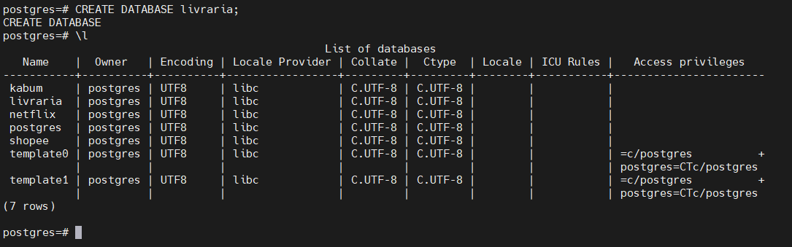
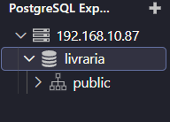
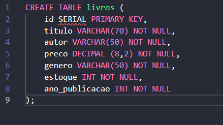
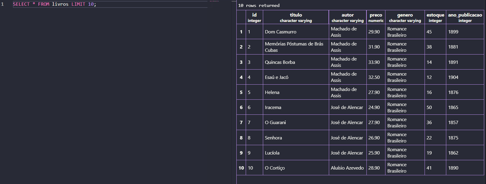
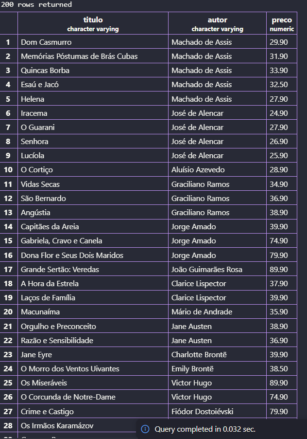
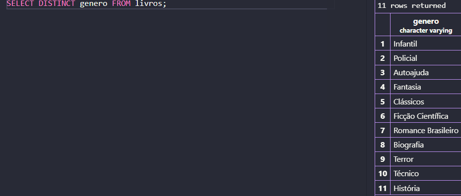
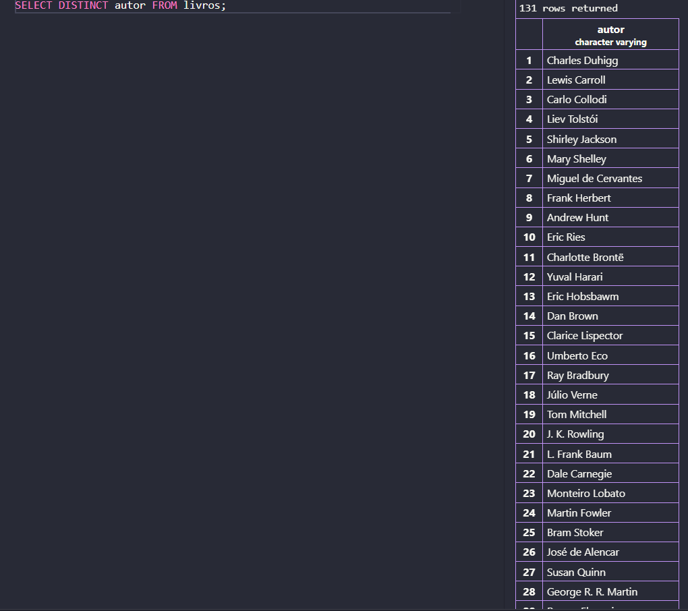
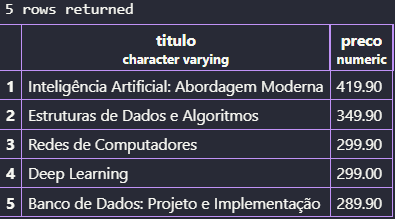
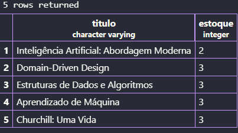

Para começar criei um banco de dados chamado livraria.



Após isso, fiz uma nova conexão pela extensão no VsCode.



### Bloco 1

Partindo para a criação da tabela:



Para inserir os valores na tabela, apenas copiei e colei do arquivo que estava no Classroom.

Para ordenar aos 10 primeiros registros, o comando utilizado foi:
```sql
SELECT * FROM livros LIMIT 10;
```



Para exibir apenas as colunas de titulo, autor e preço de todos os livros o comando usado foi:
```sql
SELECT titulo, autor, preco FROM livros;
```



Para listar os gêneros distintos no banco, usei o comando:
```sql
SELECT DISTINCT genero FROM livros;
```



Para exibir todos os diferentes autores existentes, usei o comando
```sql
SELECT DISTINCT autor FROM livros;
```


Para listar os 5 livros mais caros com titulo e autor, utilizei o comando:
```sql
SELECT titulo, preco FROM livros
ORDER BY preco DESC LIMIT 5;
```


Para listar os 5 livros com menor estoque, utilizei:
```sql
SELECT titulo, estoque FROM livros
ORDER BY estoque LIMIT 5;
```


### Bloco 2
